### Description
მოცემული პრობლემის გადაჭრა გადავწყვიტე strategy pattern-ისა და .net DI container-ის ერთობლივად გამოყენებით<br />
ყველა ინტერფესის იმპლემენტაციის injection ხდება სტარტაპიდან და დეფენდენსიები ნაწილდება კონსტრუქტორის ინჯექშენით<br />
დავალებიდან PercentProviderSelector ნაწილი გადავწყიტე შემდეგნაირად რომ, თითო პროვაიდერისთვის შესაბამისი პროცენტი გამეტანა appsetting.json კონფიგში და მაგის მიხედვით ამეღო რომლის შესაბამის მნიშვნელობასაც გადავცემდი რექვესთიდან <br />
Error-ს აბრუნებს ორ შემთხვევაში

- თუ სტრატეგიად ავირჩევთ Percent-ს და ისეთ პროცენტს გადავცემთ რომელიც არ არის გაწერილი კონფიგში
- თუ რექვესთის RequiredStrategy ველში გადავცემთ ისეთ მნიშვნელობას რომელიც არ არის ProviderStrategy enum-ში (System.Text.Json-ის ვალიდაციით არის ავტომატურად)

აქვე ვურთავ რექვესთის მაგალითებს
```json
{
  "mobileNumber": "123321",
  "text": "string",
  "requiredStrategy": "Random",
  "targetPercent": 0
}
```
```json
{
  "mobileNumber": "123321",
  "text": "string",
  "requiredStrategy": "Percent",
  "targetPercent": 10
}
```

ქვემოთ მოყვანილია class diagram

```mermaid
classDiagram
  class ProviderStrategy {
        <<enumeration>>
      Random
      Percent
  }
  class ProviderName {
        <<enumeration>>
      Magti
      Twilio
      Geocell
  }
  class SendSmsRequest {
     string MobileNumber
     string Text
     ProviderStrategy RequiredStrategy
     decimal? TargetPercent
  }
  class SendSmsResponse {
     string Message 
     bool IsSuccessful 
  }
  class SmsController {
      Send(SendSmsRequest request) IActionResult
  }
  class ISmsServiceContext {
        <<interface>>
      SendSms(SendSmsRequest request) SendSmsResponse
  }
  class SmsServiceContext {
      SendSms(SendSmsRequest request) SendSmsResponse
      IEnumerable~ISmsProviderStrategy~ _strategies
  }
  class ISmsProviderStrategy {
         <<interface>>
      ProviderStrategy StrategyName
      GetProvider(SendSmsRequest request) IProvider
  }
  class PercentProviderStrategy {
     IEnumerable~IProvider~ _providers;
     ProviderStrategy StrategyName
     GetProvider(SendSmsRequest request) IProvider
  }
  class RandomProviderStrategy {
     List~IProvider~ _providers;
     ProviderStrategy StrategyName
     GetProvider(SendSmsRequest request) IProvider
  }
  class IProvider {
       <<interface>>
      ProviderName Name
      SendSms(string mobile, string text) SendSmsResponse
  }
  class GeocellSmsProvider {
      ProviderName Name
      SendSms(string mobile, string text) SendSmsResponse
  }
  class MagtiSmsProvider {
      ProviderName Name
      SendSms(string mobile, string text) SendSmsResponse
  }
  class TwilioSmsProvider {
      ProviderName Name
      SendSms(string mobile, string text) SendSmsResponse
  }

  SmsController ..> ISmsServiceContext
  SmsServiceContext --|> ISmsServiceContext
  SmsServiceContext ..* ISmsProviderStrategy
  PercentProviderStrategy --|> ISmsProviderStrategy
  RandomProviderStrategy --|> ISmsProviderStrategy
  RandomProviderStrategy ..* ProviderStrategy
  PercentProviderStrategy ..* ProviderStrategy
  ISmsProviderStrategy ..* ProviderStrategy
  PercentProviderStrategy ..* IProvider
  RandomProviderStrategy ..* IProvider
  GeocellSmsProvider --|> IProvider
  MagtiSmsProvider --|> IProvider
  TwilioSmsProvider --|> IProvider
  IProvider ..* ProviderName
  MagtiSmsProvider ..* ProviderName
  GeocellSmsProvider ..* ProviderName
  TwilioSmsProvider ..* ProviderName
```



გამოყენებულია .Net 8/C# 12
